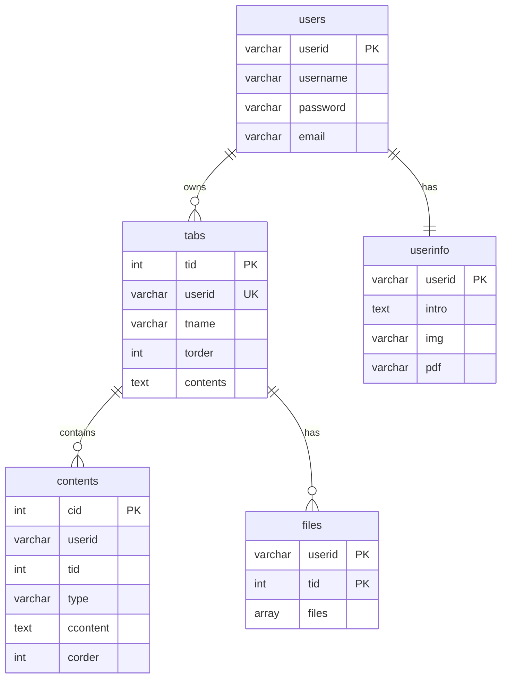

# Easiest CV

> CV: Curriculum Vitae. 이력서. (= Résumé)
> 대학교수의 이력서를 한정해 의미하기도 함.

가장 심플한 연구자 학술 개인 홈페이지 제작 툴. 
내용만 채우세요! 디자인 고민도, 복잡한 사이트 관리도 없습니다. 

철학과 박사과정생 지인의 요청으로 시작된 프로젝트로, 연구 업적과 이력을 간단히 정리하고자 하는 인문학 및 사회과학 분야의 교수 및 연구자를 대상으로 기획된 서비스입니다.  
디자인도 레이아웃도 귀찮고 기존의 홈페이지 제작 툴조차 배우기 어려울 때,  
컴퓨터로 이메일 보낼 줄 아는 수준이면 충분한, 오직 내용만 입력해서 CV 웹사이트를 만들 수 있는 서비스. 

배포 주소: https://easiest-cv.vercel.app/  
ID: tutorial / PW: easiestcv

# Database Schema

## Tables

### users

사용자 계정 정보를 저장합니다.

- userid: 사용자 고유 식별자 (Primary Key)
- username: 사용자명
- password: 암호화된 비밀번호
- email: 이메일 주소

### userinfo

사용자 프로필 정보를 저장합니다.

- userid: 사용자 식별자 (Primary Key, Foreign Key → users)
- intro: 자기소개
- img: 프로필 이미지 URL
- pdf: PDF 파일 URL

### tabs

사용자의 탭(카테고리) 정보를 저장합니다.

- tid: 탭 고유 식별자 (Primary Key)
- userid: 사용자 식별자 (Unique)
- tname: 탭 이름
- torder: 탭 정렬 순서
- contents: 탭 내용

### contents

탭 내부의 콘텐츠 블록을 저장합니다.

- cid: 콘텐츠 고유 식별자 (Primary Key)
- userid: 사용자 식별자
- tid: 탭 식별자
- type: 콘텐츠 타입 (text, image, code 등)
- ccontent: 콘텐츠 내용
- corder: 콘텐츠 정렬 순서

### files

탭에 첨부된 파일 정보를 저장합니다.

- userid: 사용자 식별자 (Composite Primary Key)
- tid: 탭 식별자 (Composite Primary Key)
- files: 파일 배열
